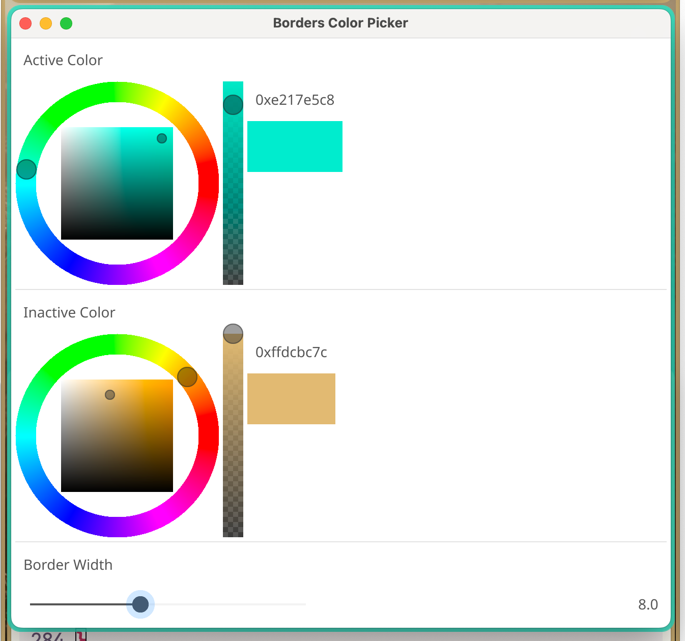
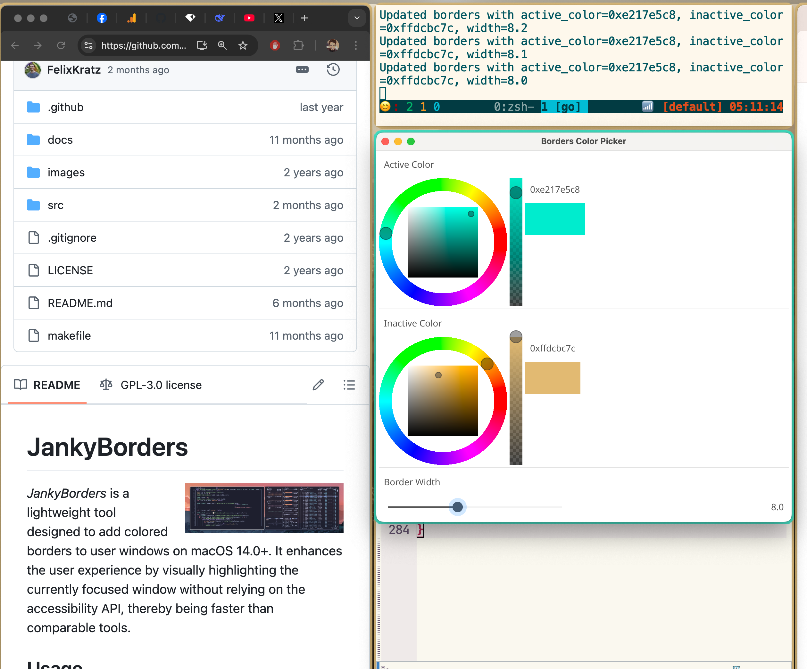

# JanyBorder in Steroids with colorpicker 



**Borders Color Picker** is a Fyne-based GUI tool written in Go that lets you dynamically update the border properties of the [JankyBorders](https://github.com/FelixKratz/JankyBorders) binary. 


With this tool you can adjust:

  - **Active Color:** The color of the active border.
  - **Inactive Color:** The color of the inactive border.
  - **Border Width:** The thickness of the border (with a range from 0 to 20).

    Changes are immediately applied to the running `borders` instance, and your settings are saved to a configuration file so they persist between sessions.


## Features

- **Dynamic Updates:** Immediately apply changes by launching the `borders` binary with new options.
- **Dual Color Pickers:** Separate color selectors for active and inactive border colors.
- **Border Width Slider:** Adjust the border width with an extended slider (0 to 20, with the slider resized for ease-of-use).
- **Configuration Persistence:** Saves your current selections to `~/.config/border_picker.json` and loads them on startup.




## Prerequisites

- [Go](https://golang.org/) (version 1.16+ recommended)
- [Fyne](https://fyne.io/) (GUI framework for Go)
- [lusingander/colorpicker](https://github.com/lusingander/colorpicker)
- The `borders` binary from [JankyBorders](https://github.com/FelixKratz/JankyBorders) must be available in your PATH.

## Installation

1. **Clone the Repository:**

   ```bash
   git clone https://github.com/yourusername/border-picker.git
   cd border-picker

2.	Install Dependencies:

go get fyne.io/fyne/v2
go get github.com/lusingander/colorpicker


3.	Build the Application:

go build -o border_picker main.go


## Usage
	1.	Ensure the borders binary is available in your PATH.
	2.	Run the application:


	3.	Use the GUI to select your active color, inactive color, and border width.
	    •	The color pickers display the selected hex value along with a color sample.
	    •	The border width slider (ranging from 0 to 20) has been extended (e.g., 300 pixels wide) for easier adjustment.

    Your changes are applied in real time by re-launching the borders binary with updated options, and your selections are saved to ~/.config/border_picker.json for future sessions.

## Configuration File

The configuration file is stored at ~/.config/border_picker.json and holds your current selections in JSON format. An example configuration file looks like:
```js
{
  "active_color": "0xffe2e2e3",
  "inactive_color": "0xff414550",
  "border_width": 6.0
}
```
## License

This project is licensed under the MIT License. See the LICENSE file for details.

## Acknowledgements
	•	[Fyne](https://fyne.io/)
	•	[lusingander/colorpicker](https://github.com/lusingander/colorpicker)
	•	[JankyBorders](https://github.com/FelixKratz/JankyBorders)

